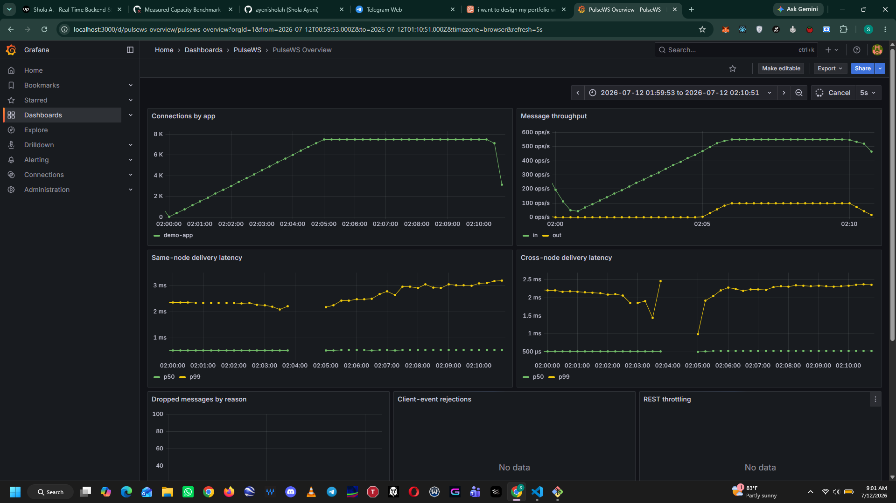
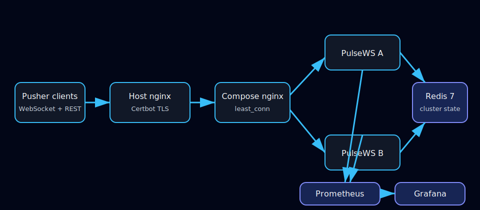

# PulseWS

[](https://github.com/ayenisholah/PulseWS/actions/workflows/ci.yml)
[](https://github.com/ayenisholah/PulseWS/releases/latest)
[](LICENSE)
[](package.json)
[](https://github.com/ayenisholah/PulseWS/pkgs/container/pulsews)

Self-hosted, Pusher-compatible WebSocket pub/sub server in TypeScript.

PulseWS is a protocol-compatible real-time messaging server for applications
that already use `pusher-js` and official Pusher server SDKs. It combines
compatibility, Redis-backed horizontal fan-out, production observability, and
published measured load-test results.

**[Live demo](https://pulsews.sholaayeni.xyz)** ·
**[Documentation](docs/README.md)** ·
**[Deployment](deploy/README.md)** ·
**[Monitoring](docs/MONITORING.md)** ·
**[Benchmarks](docs/loadtest.md)** ·
**[Latest release](https://github.com/ayenisholah/PulseWS/releases/latest)**

## Highlights

- Works with unmodified `pusher-js` and the official Pusher Node SDK.
- Runs as a Redis-backed multi-node cluster with shared presence and failover.
- Sustained **7,500 concurrent connections** on the documented shared 4-vCPU
  VPS while publishing 50 signed events per second.
- Measured **9 ms publish-to-deliver p99** at the stable maximum.

## Quick start

Requirements: Node.js 22+, npm, and optionally Redis 7 for multi-node fan-out.

```sh
git clone https://github.com/ayenisholah/PulseWS.git
cd PulseWS
npm install
cp pulsews.config.example.json pulsews.config.json
npm run dev
```

On PowerShell, replace the copy command with:

```powershell
Copy-Item pulsews.config.example.json pulsews.config.json
```

Before using the server outside local development, replace the example app
secret in `pulsews.config.json` with a long random value. Remove `redisUrl` for
a single-node installation without Redis. The server listens on port `6001` by
default; open <http://127.0.0.1:6001/health> to verify it.

See the [installation and usage guide](docs/INSTALLATION.md) for private and
presence authentication, SDK examples, Redis setup, and common errors.

## Status

Version 0.1.0. The TypeScript scaffold, validated config loading,
uWebSockets.js handshake, public channels, connection liveness, and the signed
REST publishing and the single-node MVP are in place, including public,
private, and presence channels, rate-limited client events, an opt-in live
browser demo, Redis-backed multi-node event fan-out, cluster-wide presence,
dead-node cleanup, connection caps, REST publish throttling, and a production
Compose cluster verified across two VPS containers. The measured stable
maximum on the shared 4-vCPU VPS is 7,500 concurrent connections with 9 ms
publish-to-deliver p99 latency.

Implemented:

| Area | Status |
|---|---|
| TypeScript project scaffold | Done |
| Strict typecheck and Vitest verify loop | Done |
| Validated JSON config loader | Done |
| Pusher protocol handshake | Done |
| Public channel subscribe/unsubscribe | Done |
| Ping/pong liveness and connection reaping | Done |
| Signed REST publish API | Done |
| Private channels | Done |
| Client events and per-connection rate limiting | Done |
| Presence channels | Done (single node and Redis cluster) |
| Integrated browser demo | Done |
| Redis fan-out adapter | Done |
| Redis heartbeat and dead-node cleanup | Done |
| Connection caps and REST publish limits | Done |
| Docker Compose cluster | Done; two-node VPS smoke passed |
| Prometheus metrics and Grafana dashboard | Implemented and accepted on the VPS |
| Graceful shutdown and SDK failover | Done; production workflow passed |
| k6 harness | Implemented; fixed acceptance and tiered VPS benchmark complete |
| Measured load-test results | 7,500 stable concurrent connections; 9 ms delivery p99 |
| One-hour production soak | Passed at 3,750 connections; RSS decreased 21.19 MiB |

The measured result includes contention from k6 running on the same VPS. See
the [load-test report](docs/loadtest.md) for hardware, thresholds, peaks, and
the failed 10,000-tier stop reason.



The dashboard image is evidence from the measured capacity run, not a claim
about other hardware. See the [complete benchmark report](docs/loadtest.md).

## Why

Hosted real-time services price by concurrent connections and message volume.
For teams that already depend on the Pusher protocol, the lowest-friction
self-hosting path is protocol compatibility: keep the existing client and
server SDKs, change the host configuration, and move the fan-out infrastructure
in-house.

PulseWS targets that migration path:

- `pusher-js` protocol 7 compatibility.
- Public, private, and presence channels.
- Signed publish API compatible with the official Pusher Node SDK.
- Redis pub/sub for multi-node delivery.
- Per-app credentials, limits, rate limiting, and Prometheus metrics.
- k6 scenarios that publish measured connection and latency results.

## Problem, audience, and value

PulseWS helps teams move an existing Pusher-based real-time application onto
self-hosted infrastructure without replacing familiar client and server SDK
integrations. It is aimed at backend, platform, DevOps, and full-stack
engineers operating WebSocket messaging, private or presence channels, or
workloads whose hosted-service costs are growing.

The project demonstrates a controlled migration path: protocol-compatible
clients and publishing, Redis-backed horizontal scaling, production
observability, and capacity backed by documented measurements. It focuses on
the core Pusher Channels surface rather than claiming compatibility with every
Pusher feature. See the [project story and interview guide](docs/PROJECT_STORY.md)
for the problem, design, evidence, limitations, and ready-to-use explanations.

## Architecture



Host nginx and Certbot terminate public TLS and proxy to the localhost-bound
Compose nginx service. Compose balances WebSockets and REST requests across
two PulseWS nodes. Redis owns event fan-out, presence, connection reservations,
and node liveness; Prometheus and Grafana remain operator-only services.

## Compatibility

| Pusher-compatible surface | Status |
|---|---|
| Protocol 7 connection handshake and ping/pong | Supported |
| Public channels | Supported |
| Private-channel authentication | Supported |
| Presence rosters and member events | Supported |
| Client events on private/presence channels | Supported |
| Official Node SDK signed event publishing | Supported |
| Multi-channel publish and socket exclusion | Supported |
| Webhooks | Not implemented |
| Encrypted channels | Not implemented |

## Development

Requirements:

- Node.js 22+
- npm
- Redis 7 when `redisUrl` is configured
- Bash or Git Bash if you want to run `scripts/verify.sh`

Install dependencies:

```sh
npm install
```

Run the project verification loop:

```sh
npm run verify
```

On Windows, the repository-level verification script may need an execution
policy bypass:

```powershell
powershell -ExecutionPolicy Bypass -File scripts\verify.ps1
```

When `redisUrl` is omitted, PulseWS uses in-process delivery. When it is
configured, each node opens dedicated Redis publisher and subscriber
connections and subscribes once per app. Events are delivered on every node,
including the publisher, only after the Redis echo. A configured node fails
startup if Redis is unavailable; it never silently falls back to isolated
local delivery.

With Redis configured, presence membership is stored per app and channel in a
Redis hash keyed by socket. Lua join and leave operations make unique-user
rosters and first-join/last-leave events atomic across nodes. Membership
records include the user identity, user info, and owning node ID.

Redis nodes register a 30-second heartbeat refreshed every 10 seconds and keep
persistent socket records. A live peer sweeps expired nodes, removes leaked
presence and connection state atomically, and emits final member-removal
events. Application connection caps are reserved atomically across nodes.

`maxRestPublishesPerSecond` defaults to 100 for each app. PulseWS divides that
allowance by `PULSEWS_CLUSTER_SIZE` and enforces the resulting per-node token
bucket; exhausted requests return HTTP 429 and recover as tokens refill.

The two-node integration test runs when `PULSEWS_TEST_REDIS_URL` is set. CI
provisions Redis 7 and always runs this gate.

## Configuration

PulseWS reads `pulsews.config.json` by default. Set `PULSEWS_CONFIG` to use a
different path. Production mounts this file read-only and never copies it into
the image.

| Field | Meaning |
|---|---|
| `port` | HTTP/WebSocket listen port |
| `redisUrl` | Optional Redis URL; omission selects single-node memory mode |
| `apps[].id` | Server-side application identifier used by REST publishing |
| `apps[].key` | Public key used in WebSocket URLs and signatures |
| `apps[].secret` | Private signing secret; never expose to browsers |
| `apps[].maxConnections` | Cluster-wide concurrent connection limit |
| `apps[].maxClientEventsPerSecond` | Token-bucket allowance per connection |
| `apps[].maxRestPublishesPerSecond` | Application publish allowance divided across configured nodes |
| `demo.appKey` / `demo.channel` | Optional restricted anonymous demo routes |

Cluster containers also set stable `PULSEWS_NODE_ID` values and
`PULSEWS_CLUSTER_SIZE=2`. Invalid configuration or unavailable configured
Redis causes startup to fail rather than silently degrading.

## Client and server usage

Point an unmodified `pusher-js` client at PulseWS:

```js
import Pusher from "pusher-js";

const pusher = new Pusher("demo-key", {
  cluster: "mt1",
  wsHost: "pulsews.sholaayeni.xyz",
  wssPort: 443,
  forceTLS: true,
  enabledTransports: ["ws", "wss"],
  disableStats: true,
  channelAuthorization: { endpoint: "/pusher/auth" },
});

const channel = pusher.subscribe("private-orders");
channel.bind("order.updated", (event) => console.log(event));
```

The official Node SDK signs REST publishes without custom request code:

```js
import Pusher from "pusher";

const pusher = new Pusher({
  appId: "demo-app",
  key: "demo-key",
  secret: process.env.PULSEWS_APP_SECRET,
  host: "pulsews.sholaayeni.xyz",
  port: 443,
  useTLS: true,
});

await pusher.trigger("private-orders", "order.updated", { id: "order-42" });
```

Public channels require no subscription signature. Private channels sign
`socket_id:channel`; presence channels additionally sign JSON `channel_data`
containing `user_id` and optional `user_info`. Client events must start with
`client-`, are accepted only from subscribed private/presence channels, and
exclude their sender. Events are limited to 10 KiB and channel names to 200
characters.

## Metrics and operations

`GET /health` returns the stable node ID. `GET /metrics` exposes connections,
subscriptions, directional messages, same/cross-node delivery histograms,
drops, rejections, throttling, process CPU/memory, heap, and event-loop lag.
Prometheus scrapes both nodes every five seconds; the provisioned Grafana
dashboard uses the `pulsews-prometheus` datasource.

Prometheus and Grafana are provisioned with the Compose stack and bind to
localhost in production. Open a secure operator tunnel:

```sh
ssh -N -L 3000:127.0.0.1:3000 -L 9090:127.0.0.1:9090 user@your-vps
```

Then use <http://localhost:3000> for the **PulseWS Overview** dashboard and
<http://localhost:9090/targets> to confirm both nodes are being scraped. See
the [monitoring guide](docs/MONITORING.md) for panel meanings, validation,
retention, and troubleshooting.

For upgrades, deploy a pinned GHCR tag or digest with `docker compose pull`
and `docker compose up -d`, then run cluster and failover smoke gates. Roll
back by restoring the previous image reference. Back up the application
config, nginx/Certbot state, and Redis/Grafana/Prometheus volumes before an
upgrade; verify backups by restoring them to a disposable host.

Troubleshooting checklist:

- Failed startup: validate the JSON config and Redis URL, then inspect both
  PulseWS container logs.
- WebSocket failures: verify DNS/TLS, nginx Upgrade headers, `/health`, and the
  configured app key.
- HTTP 401: check app ID/key/secret, clock skew, raw request body, and signing
  host/port/TLS settings.
- Missing cross-node events: confirm both Prometheus targets and Redis health,
  then inspect dropped-message metrics.
- Presence drift: inspect node heartbeat/socket keys and run the failover gate.
- HTTP 429 or client error 4301: reduce publish/client-event rate or adjust
  the corresponding application limit intentionally.

## Production deployment

The supported production topology uses host nginx/Certbot for public TLS and
the Compose stack for two PulseWS nodes, Redis, internal nginx, Prometheus,
and Grafana. On an Ubuntu VPS:

```sh
sudo mkdir -p /opt/pulsews/deploy
sudo cp deploy/pulsews.config.example.json /opt/pulsews/deploy/pulsews.config.json
sudo nano /opt/pulsews/deploy/pulsews.config.json
```

Set a unique app secret and deploy an immutable release image through
**Actions -> Deploy Production** using an explicit tag such as `v0.1.0`.
The workflow uploads the Compose bundle, persists the selected image in
`/opt/pulsews/deploy/.env`, waits for both nodes to become healthy, verifies
that they use the same image digest, and optionally runs smoke/failover gates.
It refuses mutable `edge` and `latest` tags.

Required GitHub `production` environment secrets are `VPS_HOST`, `VPS_USER`,
`VPS_SSH_KEY`, and `VPS_KNOWN_HOSTS`. Smoke testing also requires
`PULSEWS_SMOKE_URL`, `PULSEWS_APP_ID`, `PULSEWS_APP_KEY`, and
`PULSEWS_APP_SECRET`.

Verify a deployment on the host:

```sh
docker compose -f /opt/pulsews/deploy/docker-compose.yml ps
curl -fsS https://your-pulsews-host.example/health
```

Follow the complete [production deployment runbook](deploy/README.md) for
DNS, TLS, nginx, firewall, file-descriptor limits, backups, upgrades,
rollback, smoke tests, and SSH tunnels.

## Security

Keep application secrets in the mounted config and GitHub environment only;
rotate them after any exposure. Disable demo mode for applications that do not
need anonymous compatibility testing. In production, expose only SSH, HTTP,
and HTTPS; monitoring and direct-node ports bind to localhost. Use strong
Grafana credentials, SSH tunnels for operator access, encrypted backups,
strict SSH host-key checking, and immutable image references. See
[SECURITY.md](SECURITY.md) for vulnerability reporting.

## Compose Cluster

The production stack and smoke gate live under [`deploy/`](deploy/README.md).
It runs two stable-ID PulseWS nodes, Redis 7, nginx `least_conn`, Prometheus,
and Grafana. The production image is built in GitHub Actions and pulled from
GHCR, so local Docker is not required on Windows. Copy the external config
example, replace its secret, and follow the deployment README. The M3 cluster
milestone passed on the Ubuntu VPS with distinct-node routing, cross-node
presence, nginx demo authorization, and signed REST delivery.

Prometheus, Grafana, and the two direct node diagnostic ports bind only to
localhost. Use SSH port forwarding for operator access, for example:

```sh
ssh -L 3000:127.0.0.1:3000 -L 9090:127.0.0.1:9090 user@your-vps
```

Deployment, TLS migration, secret rotation, backups, rollback, recovery,
firewall, failover, and load-test procedures are documented in the
[deployment runbook](deploy/README.md). The [load-test report](docs/loadtest.md)
contains only measured results from the target VPS.

## Browser Demo

The deployed demo is available at <https://pulsews.sholaayeni.xyz>.

The example configuration enables an anonymous guest demo for one presence
channel. Copy it, start PulseWS, and open <http://127.0.0.1:6001>:

```powershell
Copy-Item pulsews.config.example.json pulsews.config.json
npm run dev
```

Open a second tab to watch the presence roster update and exchange client
events. The `demo` configuration is optional; when omitted, the page and its
restricted guest authorization route are not registered. Demo authorization
is for local compatibility testing, not application identity. The example
config enables Redis at `redis://localhost:6379`; remove `redisUrl` for a
single-node local demo without Redis.

## Roadmap

The original compatibility, clustering, observability, and measured-capacity
milestones are complete for `v0.1.0`. See the
[future releases roadmap](docs/FUTURE_RELEASES.md) for proposed post-`v0.1.0`
work. Roadmap items are not commitments until assigned to a release.

## Scope

PulseWS deliberately does not include a bespoke admin dashboard, webhooks,
database-backed app management, encrypted channels, or clustering beyond Redis
pub/sub. Those are documented as future work so the core compatibility and
scaling story stays focused.

## Repository Map

| Path | Purpose |
|---|---|
| `src/` | TypeScript source |
| `public/` | Opt-in browser demo assets |
| `test/` | Vitest unit and integration tests |
| `docs/README.md` | Documentation index |
| `docs/PROJECT_STORY.md` | Product story and interview guide |
| `docs/INSTALLATION.md` | Installation, configuration, and SDK usage |
| `docs/FUTURE_RELEASES.md` | Proposed future release work |
| `docs/MONITORING.md` | Prometheus and Grafana operations |
| `docs/pulsews-engineering-doc.md` | Engineering spec |
| `docs/DECISIONS.md` | Architecture decision records |
| `scripts/verify.*` | Local build, lint, and test entrypoints |

## License

[MIT](LICENSE) (c) 2026 Shola Ayeni

## Author

Built and maintained by [Shola Ayeni](https://github.com/ayenisholah).
